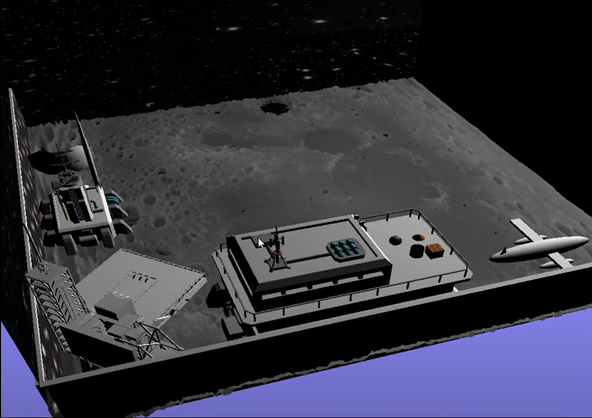

# StellarMoonScape: Projet de Réalisation d'une Scène 3D avec C++ et SDL

Ce projet vise à créer une scène 3D mettant en scène une base sur la surface de la lune dans l'espace, avec une animation d'un fusil qui se lance à partir de la base. Le code est développé en utilisant C++ et les bibliothèques SDL2 et SDL2_image.

## Configuration

  - Pour CodeBlocks : copiez le contenu de extern/mingw/lib et extern/mingw/bin/premake4.exe
  - Pour Visual Studio 2013 : copiez le contenu de extern/visual2013/lib et extern/visual2013/bin/premake4.exe
  - Pour Visual Studio 2015 : copiez le contenu de extern/visual2015/lib et extern/visual2015/bin/premake5.exe

## Utilisation

1. **Génération des Projets :**
   
Utilisez Premake pour générer les projets en fonction de votre environnement de développement.

- Pour Visual Studio 2013 : ./premake4 vs2013
- Pour Visual Studio 2015 : ./premake5 vs2015
- Pour CodeBlocks : ./premake4 codeblocks
- Pour Xcode : ./premake4 xcode
- Pour des Makefiles (Linux et macOS) : ./premake4 gmake

2. **Compilation :**

Selon votre environnement, ouvrez la solution Visual Studio, le projet Xcode, ou CodeBlocks, et compilez shader_kit ou l'un des tutoriels.

## Capture

## Vidéo de Prévisualisation

Cliquez sur l'image ci-dessus pour regarder la vidéo de prévisualisation.

## Licence

Ce projet est sous licence GNU AGPLv3. Consultez le fichier [LICENSE](LICENSE) pour plus de détails.

